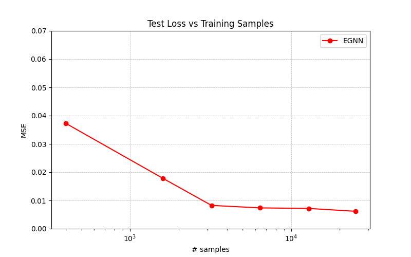

# E(n)-Equivariant Graph Neural Network (EGNN)

This repository contains an implementation of the **E(n)-Equivariant Graph Neural Network (EGNN)**, based on the paper:

>**"E(n) Equivariant Graph Neural Networks"**  
> Victor Garcia Satorras, Emiel Hoogeboom, Max Welling.   
> [Paper](https://arxiv.org/abs/2102.09844)

## Overview

EGNN is a graph neural network that maintains **equivariance** to Euclidean transformations (**rotations, translations, and reflections**) while learning representations for graph-structured data. This is particularly useful for tasks in **molecular modeling, physics simulations, and point cloud processing**.

##  Features
- **E(n)-equivariance**: Ensures outputs are consistent under Euclidean transformations.
- **Lightweight architecture**: Avoids using higher-order tensors, making it efficient.
- **Supports node features and edge attributes**.

## N-Body Experiment

One key experiment demonstrated in the original paper is the N-body experiment, where a system of five particles with different charges, initial 3D positions, and initial velocities is simulated. The model predicts their 3D positions 1,000 timesteps later, despite the inherent complexity caused by the interacting forces between particles, making the N-body problem mathematically unsolvable in closed form.

## Dataset

The dataset used for the N-body experiment can be found in this [GitHub repository](https://github.com/vgsatorras/egnn). All credit to the original authors, Victor Garcia Satorras, Emiel Hoogeboom, Max Welling, and their contributors.

## Advantages of EGNN

EGNNs do not require expensive higher-order representations in intermediate layers, yet they achieve competitive or better performance compared to existing methods. While most previous approaches are limited to 3-dimensional equivariance, EGNNs can scale to higher-dimensional spaces, making them more flexible and widely applicable in scientific and real-world problems.

## Results  

Even with a simplified implementation of EGNN, this model outperforms more complex and computationally expensive architectures, demonstrating the efficiency of EGNN and its equivariance properties in the N-body experiment.  

| Method                   | MSE   |
|--------------------------|-------|
| Linear                   | 0.0819 |
| SE(3) Transformer        | 0.0244 |
| Tensor Field Network     | 0.0155 |
| Graph Neural Network     | 0.0107 |
| Radial Field             | 0.0104 |
| **EGNN (This Simplified Implementation)** | **0.0077** |

This result highlights how **even a reduced version of EGNN can effectively model complex particle interactions**, achieving a lower MSE without requiring expensive higher-order representations. While models like SE(3) Transformer and Tensor Field Network rely on intricate architectures, EGNN’s lightweight yet powerful design makes it highly efficient for physics-informed learning tasks.

### Sweep Results  

The following plot mimics the **sweep data results** from the original paper, showing how **test loss (MSE) decreases with more training samples**, further validating the robustness of this simplified EGNN implementation:

